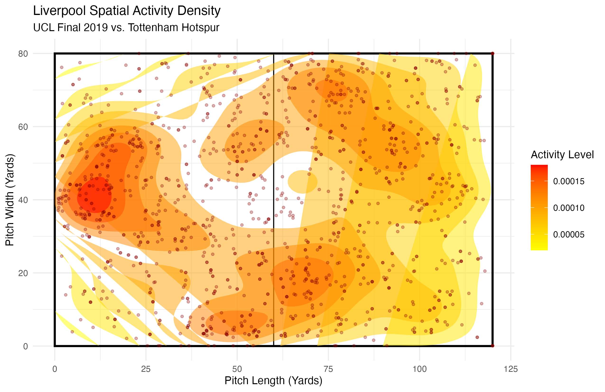
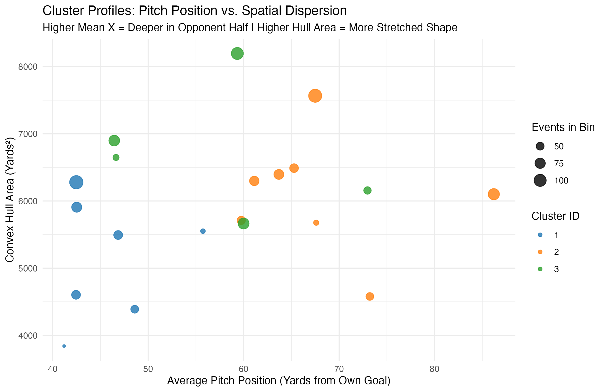
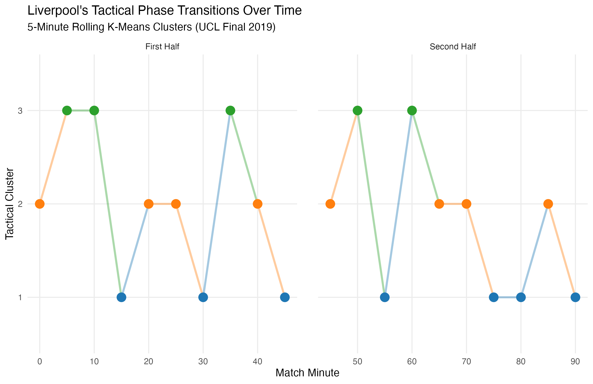

# ⚽ Temporal Spatial Clustering: Liverpool FC (2019 UCL Final)

> **An event-level spatial analysis quantifying Liverpool FC's tactical expansion, pitch height, and structural phase transitions during the 2019 UEFA Champions League Final against Tottenham Hotspur.**

---

## 📌 Executive Summary

Modern tactical analysis often aggregates match events across a full 90 minutes, obscuring how team structures expand, contract, and shift over time. 

This project uses **StatsBomb open event data** to evaluate Liverpool FC's spatial behavior across **5-minute rolling intervals** during their 2-0 victory in the 2019 UCL Final. By computing spatial centroids and **convex hull areas**, we apply unsupervised **$K$-Means Clustering** to classify Liverpool's temporal tactical states throughout the match.

---

## 🛠️ Analytics & Modeling Pipeline

### 1. Spatial Event Extraction & Binning
* **Data Source:** StatsBomb Open Data (Match ID: `22912` - 2019 UCL Final vs. Tottenham Hotspur)[cite: 1].
* **Coordinate System:** StatsBomb $120 \times 80$ yard pitch coordinates[cite: 1].
* **Temporal Binning:** Match events are binned into 5-minute intervals across both halves (`H1: 00-05`, `H1: 05-10`, etc.)[cite: 1].

### 2. Structural Metric Computation
For each 5-minute window $t$, two core spatial properties are computed[cite: 1]:
* **Pitch Centroid ($\bar{x}_t, \bar{y}_t$):** Average center-of-gravity representing team pitch height and lateral bias[cite: 1].
* **Convex Hull Area ($\text{Yards}^2$):** Measures team spatial expansion/dispersion by computing the area of the minimum convex polygon enclosing all event coordinates using the Shoelace formula[cite: 1]:

$$\text{Area} = \frac{1}{2} \left\vert{} \sum_{i=1}^{n-1} (x_i y_{i+1} - x_{i+1} y_i) + (x_n y_1 - x_1 y_n) \right\vert{}$$

### 3. Unsupervised Tactical Clustering ($K$-Means)
Standardized spatial features ($\bar{x}_t$, $\bar{y}_t$, $\text{Hull\_Area}_t$) are clustered into $K=3$ distinct tactical profiles using $K$-Means ($n_{\text{start}} = 25$, `seed = 42`)[cite: 1].

---

## 📊 Key Findings & Visualizations

### 1. Match Activity Density
An initial spatial density map reveals Liverpool's heavy activity in wide channels and defensive-third consolidation following their early opening goal[cite: 1]:



### 2. Tactical Cluster Profiles & Footprints
The $K$-Means clustering model identifies three distinct operational states based on pitch position and spatial dispersion[cite: 1]:



* **High Press / Territorial Dominance:** High average pitch position ($\bar{x}$) with large convex hull expansion[cite: 1].
* **Mid-Block Build-Up:** Balanced pitch position with moderate spatial dispersion[cite: 1].
* **Low Block / Compact Defense:** Compressed spatial area and reduced pitch height during periods under pressure[cite: 1].

### 3. Temporal Phase Transitions
Tracking these clusters over the course of the match highlights Liverpool's tactical shifts across both halves[cite: 1]:



---

## 💻 Repository Structure & Dependencies

```text
├── lfc-spatial.R           # Complete R pipeline (Ingestion -> Hull calculation -> K-Means)
├── cluster_footprint.png   # Pitch position vs. spatial dispersion scatter plot
├── cluster_timeline.png    # Temporal phase transition plot
├── lfc_density_plot.png    # Spatial activity heatmap
└── README.md               # Project documentation
